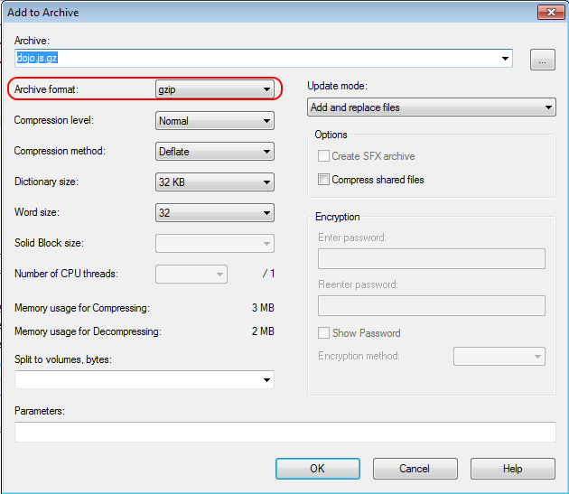
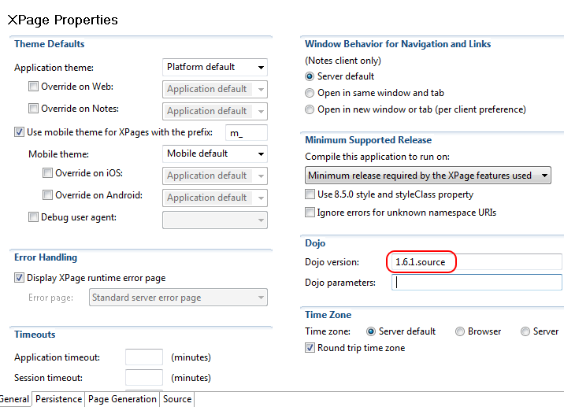
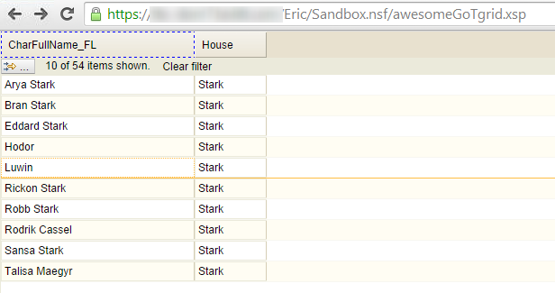

#### CLARIFICATION

This all stems form an issue with Dojo less than 1.6.2 in Chrome 29 and any browser that used the same child node reference. This post specifically covers how to fix this (as it occurs with Domino 8.5.3) and get one of the most popular web standards compliant browsers back in the game with Domino and the ExtLib/UP1 controls.

### Fixing Dojo 1.6.1 in Domino 8.5.3

I ran into a situation recently that required a bit of determination to fix. The BLUF: my implementation of the [Dojo Enhanced DataGrid was breaking when applying the dojox.grid.enhanced.plugins.Filter](https://xcellerant.net/2013/05/01/dojo-data-grid-part-14-enhanced-filtering-with-no-coding/comment-page-1/#comment-2498) due to an issue with the Dojo queries [of elements rooted at the specified element](https://dojotoolkit.org/reference-guide/1.6/dojo/query.html#queries-rooted-at-a-given-element). For example:

<pre><code> dojo.query('> *', dojo.byId('container')) </code></pre>

Thankfully, that [doesn't keep a good developer down](https://xcellerant.net/2013/05/01/dojo-data-grid-part-14-enhanced-filtering-with-no-coding/comment-page-1/#comment-6210).

### Domino 9, 8.5.3 UP1, and my Woes

IBM Domino 9 brings a great many changes to the Domino server and has been fairly well received. Stuck, for now, with 8.5.3, I was at least able to get Upgrade Pack 1 applied, giving me the basic level of the majority of the same new controls.

That being said, I still had the controls I wanted to play with, so I still tried the "play at home" version of [Brad Balassaitis](https://twitter.com/Balassaitis)' excellent series on [Dojo Grids in XPages](https://xcellerant.net/dojo-grids-in-xpages/). When I hit [Part 14: Enhanced Filtering with No Coding](https://xcellerant.net/dojo-data-grid-part-14-enhanced-filtering-with-no-coding), I found that the Filtering plugin would cause my control to break in a rather unexpected fashion.

### Dojo 1.6.1

Domino 8.5.3 has Dojo 1.6.1. The culprit in question, as I found out from attempting to use Chrome with the Enhanced Grid, the issue was with the child selector call.

![the beast in its lair])(./images/dojoBeastInLair.png)

After finding what the issue was, followed by some intense Google searching, I had found [the fix for this in Dojo 1.6.2](https://github.com/dojo/dojo/commit/fc262d0d589c490cdd671791f1546a4665ed69c6#commitcomment-3954783). The fix was small enough, I thought, "why can't I implement this?" So I did.

### Doing Something About It

#### 1. Extract the Source Dojo from the JAR

Starting about Domino 8.5.3, the Dojo library inclusion migrated from the usual source path in &lt;Domino&gt;\data\domino\js\dojo-1.x.x folder structure on the file system to a JAR deployment. The 1.6.1 source can be found in &lt;Domino program&gt;\osgi\shared\eclipse\plugins\com.ibm.xsp.dojo_8.5.3.20131121-1400.jar. To begin, we need to extract the 1.6.1 source files out of the JAR, I recommend using 7zip, though any method of un-zipping the JAR will suffice. The folder structure is in the resources\dojo-version directory. Extract that to the older format js directory in the Domino\data path and you now have a working version of the 1.6.1 Dojo library. I recommend giving your extract Dojo library a better name than my very boring 1.6.1.source; like .modified ;-)

#### 2. Apply the Fix

Per the relevant commit in Dojo 1.6.2, which addressed this issue, we need to make our change to the dojo.js file in two locations. I recommend making a backup copy of:

- dojo.js
- dojo.js.gz
- dojo.js.uncompressed.js

You can see there are actually three files, one minified, one minified and gzip'd, and one un-minified. Per the description in the [commit message](https://github.com/dojo/dojo/commit/fc262d0d589c490cdd671791f1546a4665ed69c6#commitcomment-3954783), we need to find the _root[childNodesName]_ references and replace them with _root.children &#124;&#124; root.childNodes_, found in two locations. They specified two line numbers, but mine turned out to be lines 8644 and 8925. I'm chalking up the variance to our 1.6.1 version coming to us via IBM (I'm guessing comments). Since the lines we change are those directly dealing with our issue, the child dependency handling, I know we're good. Save your file over the dojo.js.uncompressed.js file.

#### 3. Apply Again

Now that the original, un-compressed version has its updates, it's time for those minified and minified and gzip'd versions. If you're using an editor like [Notepad++](https://notepad-plus-plus.org/), you can use a plugin such as JSTool to perform the JSMin operation.

Save that file over the dojo.js file. Now for the gzip'd version. With 7zip, you can perform a right-click on the dojo.js file and select 7zip > Add to Archive. For the settings, select the correct archive format, ensuring the .gz extension gets applied and overwrite the existing dojo.js.gz file.

#### 4. Restart and Use

Now you only need to restart the Domino server and you can start using it. Just restarting the http task doesn't quite do it, as Domino needs to fully re-register all its known libraries (not just re-initialize the handling of http connections). If you don't, but you set the library in the Xsp Properties, you will not be able to load your new version, as the selected library will return a runtime error, as the server hasn't registered it yet.

To use it in an NSF, open the Xsp Properties file and specify your modified name in the Dojo version field. If you prefer the source, it's applied by _xsp.client.script.dojo.version=1.6.1.modified_ (or .source, whichever you call it). Note to leave off the _dojo-_ prefix.

### Rejoice

You are now able to use the Dojo Enhanced DataGrid with the _dojox.grid.enhanced.plugins.Filter_!

